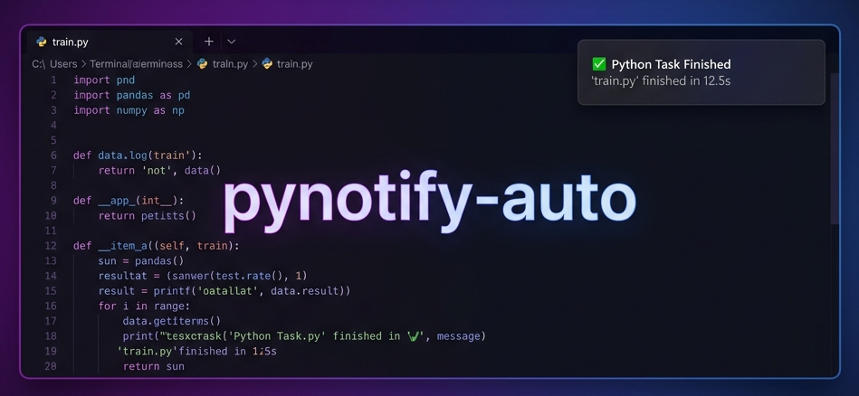

# pynotify-auto



[](https://pypi.org/project/pynotify-auto/)
[](https://pypi.org/project/pynotify-auto/)
[](https://github.com/shahbhuwan/pynotify-auto/stargazers)
[](https://github.com/shahbhuwan/pynotify-auto/network)
[](https://github.com/shahbhuwan/pynotify-auto/actions)
[](https://opensource.org/licenses/MIT)
[](https://pypi.org/project/pynotify-auto/)

**Zero-Code automatic notifications for any long-running Python script.**

> [!TIP]
> **Stop babysitting your terminal.** Whether you're training models, processing datasets, or running complex simulations, `pynotify-auto` pings you the moment your task is done—so you can focus on what matters.

## 🚀 Quick Demo


*(Coming soon: An interactive demo of pynotify-auto in action!)*

## Why use this?
Traditional notification libraries require you to manually add decorators or extra lines of code to every script. `pynotify-auto` is different: **it works automatically for every script in your environment.** 

- **No Code Changes**: Install once, and it works for all your scripts.
- **Smart Filtering**: It stays quiet for quick tasks and only alerts you for the ones that actually take time.
- **Immediate Feedback**: Know exactly when your process finishes or fails, even if you're in another room.

## Features

- **Zero-Code Integration**: Works automatically across your entire system/environment.
- **Smart Thresholding**: Only pings if the script ran for a meaningful amount of time (default > 5s).
- **Cross-Platform**: Works on Windows, macOS, and Linux.
- **Configurable**: Change the threshold or disable it via environment variables.

## Installation

### Via Pip
```bash
pip install pynotify-auto
```

> [!IMPORTANT]
> **Activation Step**: Due to how modern Python environments (Conda, venv) handle installation, you may need to manually enable the zero-code hook once after installation:
> ```bash
> pynotify-auto --enable
> ```
> This ensures that `pynotify-auto` can monitor your scripts automatically. You can check the status at any time with `pynotify-auto --info`.

## Examples

### Using Environment Variables
You can customize the behavior on the fly without changing any code:

```bash
# Only get a sound notification (no popup)
export PYNOTIFY_MODE=sound
python training.py

# Only notify if script takes longer than 10 minutes
export PYNOTIFY_THRESHOLD=600
python long_process.py

# Temporarily disable notifications for a specific run
PYNOTIFY_DISABLE=1 python quick_test.py
```

### Using the Command Line (CLI)
Test your settings or check your configuration directly from the terminal:

```bash
# Trigger a test notification to see it in action
pynotify-auto --test

# Show your current settings (Mode, Threshold, Status)
pynotify-auto --info
```


## 🌟 Star History

[](https://star-history.com/#shahbhuwan/pynotify-auto&Date)

## 🤝 Used By

Are you using `pynotify-auto` in your project? We'd love to feature you here! 
Open a PR to add your project to the list.

## License

MIT

## Contributing

I'm open to contributions! Feel free to fork the repo and open a PR if you have bug fixes or new notification backends (Slack, Discord, etc.) you'd like to add.

Check the [comprehensive test suite](tests/test_comprehensive.py) for examples on how to run tests locally.


